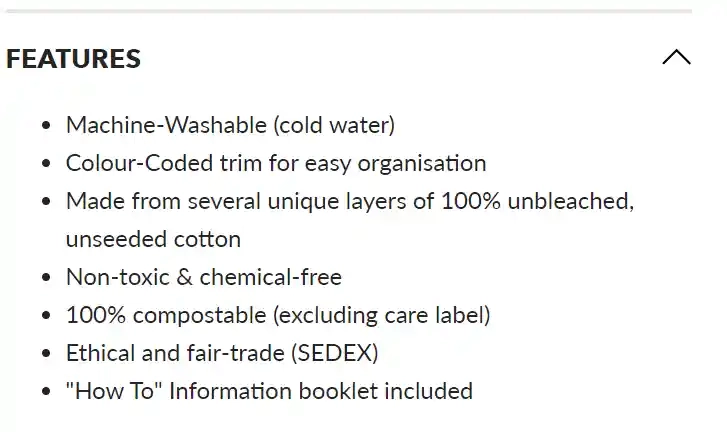
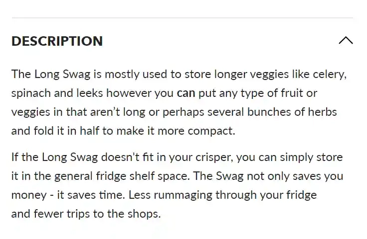

# Define Your Target Market in 6 Simple Steps (With Examples)

---

Growing a business is like learning to ride a bike—you fall a few times, scrape your knees, but eventually figure out when to pedal hard and when to coast. Same goes for marketing. You learn when throwing money at ads actually works, and when you're basically just lighting cash on fire for fun.

Here's the thing though: before you start plastering ads everywhere and slashing prices like it's Black Friday every day, you need to know who you're actually talking to. And no, "everyone" is not your target market. Trust me, "everyone" includes my grandmother who still thinks the internet is a passing fad. Your target market is way more specific—it's that group of people who'll actually pull out their wallets when they see your stuff.

So who are these magical wallet-opening people? That's exactly what we're figuring out today. I'll walk you through how to identify your target market segment with some actual audience research (don't worry, it's not as boring as it sounds). Then we'll look at brands that made millions because they knew exactly who their customers were—and more importantly, what made them tick.

Let's dive in.

---

## What Even Is a Target Market?

A target market is basically a specific group of people you want to reach with your marketing. These folks are way more likely to visit your shop and buy something than random people scrolling Instagram at 2 AM.

They share certain things in common—maybe their age, where they live, what they're into, or how they behave online. When you zoom in even closer, you get to your ideal customer. That's the person who doesn't need convincing. They see your product and think, "Finally! Where has this been all my life?"

Your target market is really your target audience. And that's where your analysis starts—with that ideal customer. Don't be shy about getting super specific here.

Now, will other people outside this group buy from you? Sure. But here's why this matters: identifying your target audience creates an effective marketing strategy that doesn't waste money. 👉 [Discover how smart data collection can power your target market research with reliable web scraping tools](https://www.scraperapi.com/?fp_ref=coupons). Your marketing hits the people MOST likely to buy. That's just smart business.

## How to Actually Research Your Audience

To really understand your target audience, you need to do some detective work. Think of it as getting to know someone before asking them on a date—you want to know what they like, what they hate, and what makes them excited.

### 1. First, Understand Your Niche Market

Whatever you're selling, it's most valuable to a very specific set of people. That's your niche market.

Look at what you're selling and why. This helps you understand not just what you offer, but why someone would want it in the first place.

Ask yourself:
- What need does your product actually satisfy?
- Does it solve a problem in your customer's life? (And I mean a real problem, not a made-up marketing problem.)
- What are the benefits? How does someone's life actually improve?

Whenever you get lost in the weeds of your research, come back to these questions. They're your North Star.

You can use tools like Google Analytics, Facebook Insights, or other market research platforms to gather data. Surveys and focus groups work too if you want to go deeper.

### 2. Look at Your Existing Customers

If you're already making money, you have a shortcut: your current customers. They've already bought from you, which means they convert. They're living proof of your target market.

Once you understand who's already buying, you can find more people like them.

Look for patterns in:
- **Age** - What's the general age range? This helps with social media ad targeting.
- **Gender** - Are they mostly male or female? This affects messaging and product positioning.
- **Income** - Can they afford repeat purchases or do they save up?
- **Location** - Where do they live? Different regions have different needs. (Americans care about football, Europeans care about *real* football.)
- **Behavior** - How do they act online? What platforms do they use? What content do they consume?
- **Lifestyle** - How do they spend free time? What hobbies do they support?
- **Values** - What do they believe in? Does this affect brand loyalty?

You can find most of this in Google Analytics, email metrics, or social media analytics. For anything missing, create a short survey with a discount code attached. People love discounts—they'll tell you their life story for 15% off.

### 3. Dig Into Your Analytics

When placing ads or creating a digital marketing strategy, you need to know what content brings customers to your store and what actually makes them buy.

Most of this information is sitting in your analytics dashboard right now, waiting for you to actually look at it.

When you dig into the data, you'll understand your audience through four types:

1. **Demographic Segmentation** - Age, gender, location, income, education. Dry as toast, but incredibly useful for ads.
2. **Geographic Segmentation** - Where they live, what time zone. Helps with posting schedules and regional topics.
3. **Behavioral Segmentation** - Purchase patterns, loyalty, how they interact with your brand. Shows what motivates purchases.
4. **Psychographic Segmentation** - Beliefs, values, attitudes, interests, lifestyle. Reveals why they shop the way they do.

Market segmentation sounds technical, but really it's just placing super efficient ads. Your marketing effort doesn't get wasted on people who'll never buy anyway.

### 4. Spy on Your Competition

If you don't have customers yet (or even if you do), checking out competitors will help you understand your own customer profile.

Look at their website, blog, social media, and ads. Try to figure out their target market strategy. Ask yourself:

- Can you identify their segmentation tactics?
- Who's their ideal customer?
- What pricing strategies do they use?
- Do they target one market or several?
- How do they promote products? What language do they use?
- What's their posting schedule?

Become their customer. Sign up for newsletters, follow their social media. See what it's like firsthand. Take notes. This is legal corporate espionage, and it's incredibly valuable.

### 5. Understand Your Product Features vs. Benefits

Here's where things get interesting. You need to understand exactly what motivates people to buy your products.

This happens after you know who your target audience is, but before you start reaching out to them. You want to catch them while they're deciding whether to buy.

The way to do that? Show them how your product directly benefits them and improves their daily life.

Marketers call this features versus benefits. The feature is what the product *is* or *does*. The benefit is the end result and how it affects the customer's life.

Look at this Swag food storage bag example. The features list the fabric type, whether it's washable, and that it's 100% compostable. Cool. But so what?

The benefit? This product keeps fruits and veggies fresh longer, saving you money and time. *That's* what matters to customers.

By showing potential customers how they benefit from your product, they're more likely to buy. Making your marketing actually worthwhile.

If you aren't clear about your product benefits, make a list right now. Go through your top products and write exactly how each one benefits buyers.

This process helps with selling *and* identifying your target audience. Like with The Swag—if it keeps produce fresh longer, the target audience probably cooks at home, eats healthy, and cares about food waste. See how that works?

### 6. Test Paid Ads on Your Target Market

Now that you've done your analysis and have a good idea of your ideal customer, it's time to run ads.

Search engine optimization has the highest ROI long-term, but ads give you quick wins and lots of data fast.

Facebook Ads Manager lets you run ads on Facebook and Instagram easily. If you're not sure where to start, check out Audience Insights first to compare your analysis to real Facebook users.

Create a custom audience based on your analysis, then create different ad versions for the same product. Or use the same ad on different audiences.

Spend about $5 per ad set just to see how users respond. Do they click? Do they buy?

The goal is testing until you find the right combination that brings the most conversions. For brands looking beyond ads, implementing affiliate program management can attract long-term partners too.

Use this testing process regularly with each new product. When necessary, do another audience analysis to make sure you're still reaching the right people.

## Target Market Examples That Actually Crushed It

Let's look at brands that nailed their target market analysis. They found their ideal customers by being super specific and targeted.

### 1. Nike Target Market

Nike sells to athletes and people who play sports. Their products are quality and last long, which drives prices up. Only people with disposable income can afford them regularly.

But that's not all. They specifically target young aspiring athletes and runners—people who rely on motivation to push beyond normal limits.

You see this in Nike's marketing campaigns. Motivational ads that move viewers to tears. They know exactly who they're talking to.

### 2. Netflix Target Market

The lesson from Netflix isn't about their actual target market (which constantly evolves). It's about their *approach* to reaching it.

They continuously research their audience and give them what they want. From mail-in DVD rentals to streaming giant, Netflix has leaned into their audience and pivoted when needed.

By doing so, they let word-of-mouth marketing fuel their sales. Smart.

### 3. Lego Target Market

Lego is everywhere for a good reason: children use their products, but parents buy them.

So Lego built their marketing strategy around appeasing parents. They also partnered with brands, movies, and video games with cult followings, securing their place in the fantasy worlds kids escape to.

By understanding their target audience and barriers to purchase, Lego became a multi-billion dollar business.

### 4. Vans Target Market

Vans built an empire appealing to misfits and rebels. Like Netflix, they learned to lean into what worked and who wanted their products, rather than sticking rigidly to their original vision. By letting their target market guide them, they found extreme success with loyal customers.

### 5. Dior Target Market

Dior is exclusive by design. High prices, innovative design. By setting themselves apart with a niche brand, they easily found their niche audience.

But it wasn't just their unique value proposition that made them successful. It was marketing themselves as exclusive that did the trick. Understanding what kinds of people would appreciate their products, they made campaigns to match.

### 6. Coachella Target Market

Coachella hosts artists of all genres—everyone's welcome. And hipsters, who pride themselves on being unique carbon copies of everything cool, ate that up.

As Coachella's primary market, hipsters paved the way for the festival's marketing campaign. The brand partnered with other brands hipsters interact with—H&M, YouTube—to solidify their place in hipster millennial hearts. Eventually becoming a multi-million dollar annual festival.

### 7. Glossier

Glossier gained a cult following with minimalistic branding and a focus on natural beauty. Their target market? Millennials looking for a natural, effortless beauty routine. Products designed to enhance natural beauty, not conceal it.

### 8. Dollar Shave Club

Dollar Shave Club delivers quality razors and grooming products to your door. Their target market is men looking for convenient, affordable grooming solutions. They use humor in marketing to appeal to their audience, gaining a loyal following.

### 9. Fabletics

Fabletics, co-founded by Kate Hudson, targets women looking for stylish, functional athletic wear that's affordable. They use social media influencers and have built a strong community around their brand.

### 10. Warby Parker

Warby Parker offers stylish, affordable eyewear. Their target market is millennials looking for fashionable glasses at reasonable prices. They use social media and word-of-mouth marketing, building a strong brand identity.

### 11. Chewy

Chewy offers pet food, toys, and accessories. Their target market is pet owners wanting convenience and wide selection. Free 1-2 day shipping on orders over $49 and 24/7 customer service helped them gain loyal followers.

### 12. Casper

Casper disrupted the traditional mattress industry with mattresses-in-a-box. Their target market is people looking for convenient, affordable mattress buying. A 100-night trial and free shipping and returns helped build their brand.

### 13. REI

REI sells outdoor gear and apparel, encouraging people to explore outside. Their target market is outdoor enthusiasts looking for quality gear. Their co-op membership offers exclusive discounts and events, building strong brand identity around inspiring people to get outside.

---

## Time to Get Started

As an ecommerce founder, identifying your target audience gives you clearer direction on positioning yourself. Things like brand voice and brand story become easier because you know who you're reaching.

The same goes for any marketing channel—referral marketing, influencer marketing, you name it. There's no point reaching out to new moms when you're selling pet food. (Right?)

The six steps in this article provide a simple, effective framework for defining your target market. Using tools like customer personas, market research, and customer feedback, you gain deeper understanding of your audience and create more personalized experiences.

As you work through these steps, remember your target market may evolve over time. As your business grows and you gain more customer data, stay open to revising and refining your definition. Your target market isn't set in stone—it's a living thing that grows with you.

Now stop reading and start researching. Your ideal customers are out there waiting. You just need to find them.
